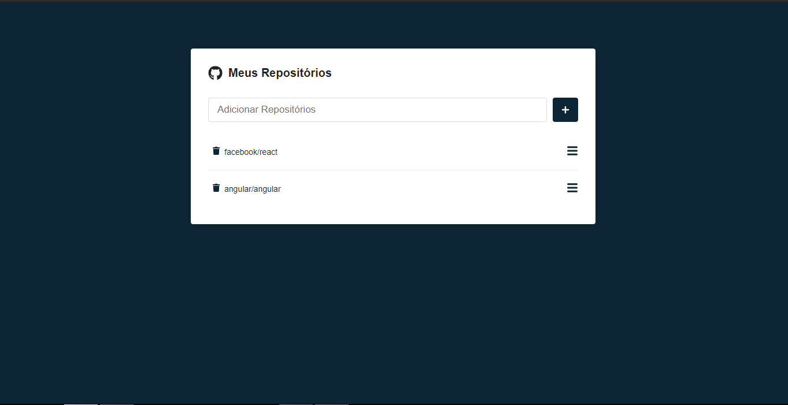

<h1 align="center">Issues GitHub</h1>

<p align="center">Liste as issues de seus repósitorios</p>

<p >
 •<a href="#-sobre"> Sobre</a> </br>
 •<a href="#-layout"> Layout</a> </br>
 •<a href="#-executando-o-happy"> Como executar</a> </br> 
 •<a href="#-tecnologias"> Tecnologias</a> </br>
 •<a href="#-como-contribuir"> Como contribuir</a> </br>
 •<a href="#-licença"> Licença</a> 
</p>

---

## 💡 Sobre

Aplicação desenvolvida durante o curso "React Js do zero ao avançado na pratica", visa listar as issues dos repositórios selecionados pelo usuário.

---

## 🎨 Layout


### Web

<p align="center">
  
  <br/>
  
</p>

---

## 💻 Executando o Issues GitHub

### Pré-requisitos

É necessário ter instalado na sua máquina para execução desse projeto:
- <a href="https://nodejs.org/en/"> NodeJS </a>;
- Gerenciador de pacotes Npm(já vem com o NodeJS) ou <a href="https://yarnpkg.com/getting-started/install"> Yarn </a>;
- <a href="https://pt-br.reactjs.org/"> React </a>;


### ♊ Clonando o Repositório

```bash

$ git clone https://github.com/SilvioDiasJr/repos_github.git

# entre na pasta do projeto

$ cd repos

```
### 💻 Executando projeto web

Instale as dependências

```bash

$ yarn install

# ou, caso use npm

$ npm install

```

Rode a aplicação

```bash

$ yarn start

# ou, caso use npm

$ npm start

```
---

## 🛠️ Tecnologias

Principais tecnologias utilizadas no desenvolvimento do projeto.

#### Web:
- ReactJS ⚛️
- React Router Dom
- API do GitHub
- Styled Components
- React Icons
---

## ⚙️ Como contribuir

- Faça um fork desse repositório;
- Crie uma branch com a sua feature: `git checkout -b minha-feature`;
- Faça commit das suas alterações: `git commit -m 'feat: Minha nova feature'`;
- Faça push para a sua branch: `git push origin minha-feature`.

---

## 📝 Licença

Este projeto está sob licença [MIT](./LICENSE).

<p>Feito com 💙 por <a href="https://www.linkedin.com/in/silviodiasjr/">Silvio Dias</a></p>
